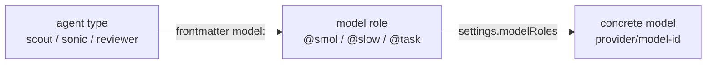

# omp: model roles vs. agent types

Two orthogonal layers.

- **Model role** = *which LLM* runs. Named alias (`@smol`, `@slow`, …) → concrete `provider/model`.
- **Agent type** = *which persona* runs (prompt + tool set + output schema). Each agent
  declares a model role in its frontmatter.

Roles answer "how strong/cheap"; agents answer "what job, what tools".

## Layer 1: model roles

Configured in `settings.modelRoles` (`/models` UI). Value is either
`provider/model-id` (pinned variant) or a canonical id (`claude-opus-4-6`),
optionally with a thinking suffix (`"@slow:high"`, `gpt-5.3-codex:medium`).

| Role | Used for |
|---|---|
| `default` | primary session model; `*` and bare `@default` |
| `smol` | fast/cheap work: scout, librarian, sonic, prewalk target |
| `slow` | strongest reasoning: reviewer, `advisor` fallback |
| `task` | generic `task` subagent |
| `designer` | `designer` subagent |
| `plan` | plan-mode model |
| `vision` | image input (`inspect_image`, image fallback) |
| `commit` | commit-message generation |
| `tiny` | background chores: session titles, memory, auto-thinking classification, TTS enhance |
| `advisor` | advisor/watchdog pass |

Fallbacks: unset `tiny` → `smol` chain, unset `advisor` → `slow` chain
(`ROLE_PRIORITY_ALIAS`, `model-resolver.ts`). Unset `smol`/`slow`/`designer`
inherit the `default` role *including its thinking suffix*
(`shouldInheritDefaultBeforePriority`). Other unset roles fall back to their
built-in priority list, ultimately the active model. A role may point at
another role; an explicit thinking suffix on the referring role wins
(`@default:medium` → `provider/id:low:medium` → medium).

`task` is the outlier: no priority chain and no default inheritance, so an
unset `task` role resolves to nothing and the spawn falls back to the parent's
**bare** model string (`formatModelString`, suffix stripped). See the thinking
level section below.

## Layer 2: agent types

An agent = markdown file with frontmatter (`name`, `description`, `tools`,
`spawns`, `model`, `thinking-level`, `output`, `read-summarize`, `prewalk`) +
system prompt body. Discovery order (first wins by name):
project `.omp/agents` → user `~/.omp/agent/agents` → Claude plugin `agents/` →
bundled.

Bundled agents and the role each maps to:

| Agent | Model role | Tools | Notes |
|---|---|---|---|
| `task` | `@task` | all | general worker, `spawns: *`, auto thinking |
| `sonic` | `@smol` | all | mechanical edits / data collection, medium thinking |
| `scout` | `@smol` | read, grep, glob, web_search | READ-ONLY research, structured output, verbatim reads |
| `librarian` | `@smol` | read, grep, glob, bash, lsp, web_search, ast_grep | dependency/API source research, minimal thinking |
| `reviewer` | `@slow` | read, grep, glob, bash, lsp, web_search, ast_grep | code review, `spawns: scout`, structured verdict |
| `designer` | `@designer` | all | UI/UX work |

So `agent: "scout"` does not name a model — it selects a read-only persona that
happens to run on whatever `modelRoles.smol` currently resolves to. Repointing
`smol` re-models scout, librarian and sonic at once.

## Resolution at spawn time

Effective model precedence (`resolveEffectiveSubagentPolicy`):

1. `task.agentModelOverrides[<agentName>]` — per-agent pin, beats frontmatter
2. agent frontmatter `model:` (the `@role` alias)
3. parent session model

Effective thinking level precedence (`executor.ts`, `effectiveThinkingLevel`):

1. per-spawn `effort: lo|med|hi` — only exposed when `task.enableEffort` is on
   (default off), then clamped by `task.maxEffort`
2. `:level` suffix on the resolved model pattern (role or
   `task.agentModelOverrides` value)
3. agent frontmatter `thinking-level:`
4. model `defaultLevel`, then the global `defaultThinkingLevel` setting
   (**ships as `high`**)

The parent session's level is *not* in this list — it never propagates.
Combined with the `@task` hole above, an unset `task` role meant every default
subagent ran the bundled agent's `auto` frontmatter, which provisions `high`,
regardless of the parent. The distro therefore pins
`modelRoles.task: "@default:medium"` (`nix/afk.nix`).

Output schema precedence: task item `outputSchema` → frontmatter `output` →
parent session schema.

Consequences of the split:

- Change *capability level* → edit `modelRoles`.
- Change *behavior/tools* → write a custom agent in `.omp/agents/`, or override
  one bundled agent's model with `task.agentModelOverrides`.
- Plan mode rewrites the agent (read-only tool allowlist, no spawns, no prewalk)
  but leaves the model role resolution intact.

## Related knobs

`task.disabledAgents`, session `spawns` policy, `task.maxRecursionDepth`
(strips `task` tool at max depth), `task.prewalk` / `task.agentPrewalk`
(start on strong model, hand off to `smol` at first edit).

Sources: `omp://models.md`, `omp://task-agent-discovery.md`,
`packages/coding-agent/src/task/agents.ts`,
`packages/coding-agent/src/prompts/agents/*.md`,
`packages/coding-agent/src/config/model-resolver.ts`.
